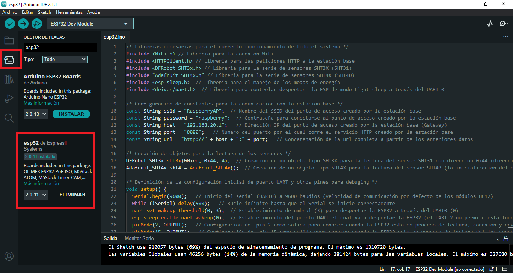
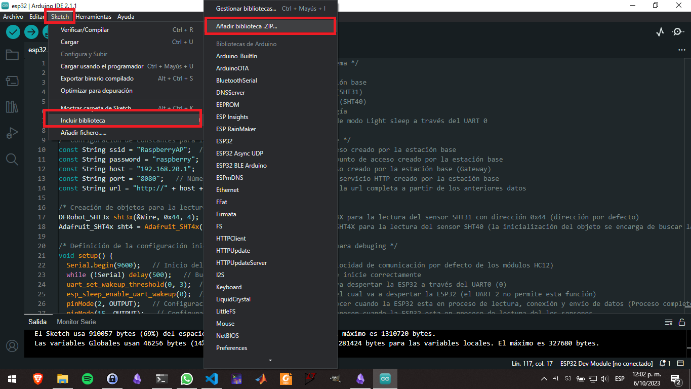
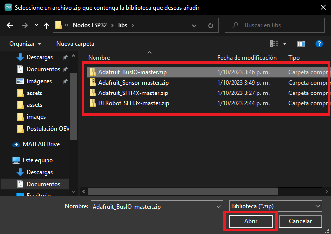
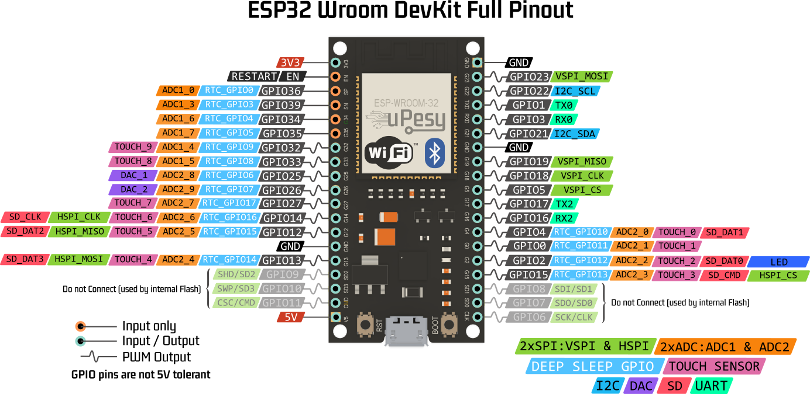

# Checklist
- [x] Conexión con la estación base
- [x] Identificación del nodo a través de la MAC en la estación base
- [x] Mediciones de los sensores
- [x] Envío de datos a la estación base
- [x] Modo light sleep controlado por la estación base.
# Configuración del IDE
1. Descargar del gestor de placas de Arduino IDE `esp32`.
	
2. Instalar las siguientes librerías (disponibles en la carpeta `libs` de este repositorio o en los enlaces adjuntos)
	- [Librería para el sensor SHT31](https://github.com/DFRobot/DFRobot_SHT3x) 
	- [Librería para el sensor SHT40](https://github.com/adafruit/Adafruit_SHT4X)
	- [Librería Sensor driver (necesaria para el funcionamiento de la librería SHT40)](https://github.com/adafruit/Adafruit_Sensor)
	- [Librería BusIO (necesaria para el funcionamiento de la librería SHT40)](https://github.com/adafruit/Adafruit_BusIO)
	Una vez descargadas todas las librerías instalarlas de la siguiente manera (se debe realizar el proceso con cada una):
	
	
# Instalación del driver de la ESP32 (CP210X) en caso de requerirlo
El driver esta disponible en la carpeta `driver` o en la [página oficial](https://www.silabs.com/developers/usb-to-uart-bridge-vcp-drivers?tab=downloads). El driver se debe instalar en caso de que ele quipo no reconozca la ESP32 una vez realizado el paso 1. Puede seguir el siguiente [tutorial](https://www.intel.la/content/www/xl/es/support/articles/000033005/intel-nuc.html) para la instalación.
# Conexiones del módulo HC12 y de los sensores SHT31 y SHT40
La conexión de los sensores y el módulo se presenta en las siguientes imágenes, las resistencias en los pines *sda* y *sck* pueden tomar cualquier valor entre 1k$\Omega$ y 10k$\Omega$. Estas cumplen la función de garantizar un estado lógico alto mientras no hay transmisión de datos.  


***NOTA:*** La conexión mostrada anteriormente en los pines de la ESP32 es ilustrativa, verificar cada pin en la siguiente imagen. 



- **Pin SCL o SCK:** GPIO 22
- **Pin SDA:** GPIO 21
- **Pin TX0:** GPIO 1
- **Pin RX0:** GPIO 3
# Consideraciones del código
## Conexión de los sensores SHT
Debido a que ambos sensores presentan la misma dirección (0x44) por defecto, y no se puede cambiar fácilmente, solo se puede conectar un sensor a la vez. A continuación se describe que líneas comentar y descomentar en caso de conectar uno u otro sensor.
- **SHT31**: con este sensor conectado es necesario descomentar las líneas 36, 37, 38 y 43 y comentar las líneas 39, 40, 41 y 42.
- **SHT40**: con este sensor conectado es necesario descomentar las líneas 39, 40, 41 y 42 y comentar las líneas 36, 37, 38 y 43.
## Conexión de futuros sensores
En caso de que posteriormente se desea conectar sensores que midan dióxido de carbono o luminosidad se debe editar las funciones de `getCo2()` (líneas112-114) y `getLuminosity()` (líneas 117-119) respectivamente.
***IMPORTANTE:*** al agregar código a estas funciones es importante que el valor retornado sea un número tipo `double` o `int` (en caso de ser `int` editar el principio de la función), no puede ser un `string`, un `array`, un `byte` o cualquier otro tipo de dato.
## Línea 52. Construcción de los datos en formato JSON
En esta línea se crea la data que será enviada a través del protocolo HTTP, por defecto se están creando todos los campos posibles, pero el único campo obligatorio para que la estación base responda con un código de estado exitoso es el de `mac` (la cual debe estar registrada en la base de datos de la estación base, ya sea por la interfaz local o por la página web), por ende, si no se desea mandar alguno de los otros datos, se pueden eliminar. Además, el nombre de los campos no puede ser cambiado, debe seguir el siguiente "contrato".
```typescript
{
	"mac": "string",
	"temp": number,
	"ha": number,
	"hs": number,
	"rad": number,
	"co2": number,
}
```
A continuación se presentan algunas variantes:
- Envío de `temperatura` 
	```c
	  String data = "{\"temp\":" + String(temp) + ",\"mac\":\"" + mac + "\"}";
	```
- Envío de `temperatura`  y `humedad ambiente`
	```c
	  String data = "{\"temp\":" + String(temp) + ",\"ha\":" + String(ha) + ",\"mac\":\"" + mac + "\"}";
	```
- Envío de `temperatura` ,  `humedad ambiente` y  `humedad del suelo`
	```c
	  String data = "{\"temp\":" + String(temp) + ",\"ha\":" + String(ha) + ",\"hs\":" + String(hs) + ",\"mac\":\"" + mac + "\"}";
	```
# Indicadores led
Las resistencias conectada al cátodo de cada led es únicamente de protección, esta puede rondar entre los 220$\Omega$ y los 440$\Omega$. 
- **Led verde:** este led estará encendido mientras la ESP32 realiza el procedimiento de lectura de los diferentes  sensores.
- **Led amarillo:** este led estará encendido mientras la ESP32 realiza el procedimiento de conexión al punto de acceso WiFi de la estación base.
- **Led rojo:** este led estará encendido mientras la ESP32 realiza el procedimiento de envío de datos a través del protocolo HTTP a la estación base.
- **Led integrado de la ESP32 (pin 2)**: este led estará encendido mientras la ESP32 esta despierta y realiza todo el proceso de lectura, conexión y envío de datos, y se apagará una vez la ESP32 entre en modo `light sleep`.
