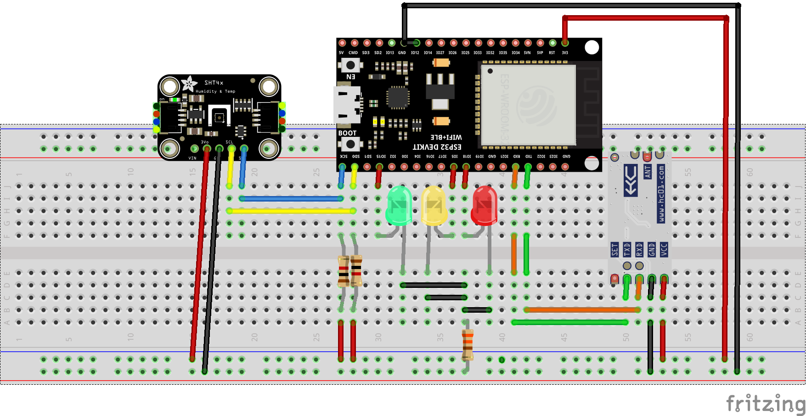

# Configuración del IDE
1. Descargar del gestor de placas de Arduino IDE `esp32`.
2. Instalar las siguientes librerías (disponibles en la carpeta `libs` de este repositorio)
	- [Librería para el sensor SHT31](https://github.com/DFRobot/DFRobot_SHT3x) 
	- [Librería para el sensor SHT40](https://github.com/adafruit/Adafruit_SHT4X)
	- [Librería Sensor driver (necesaria para el funcionamiento de la librería SHT40)](https://github.com/adafruit/Adafruit_Sensor)
	- [Librería BusIO (necesaria para el funcionamiento de la librería SHT40)](https://github.com/adafruit/Adafruit_BusIO)
# Instalación del driver de la ESP32 (CP210X) en caso de requerirlo
El driver esta disponible en la carpeta `drivers` o en la [página oficial](https://www.silabs.com/developers/usb-to-uart-bridge-vcp-drivers?tab=downloads)
# Conexiones de los sensores
Pines de la ESP32:
- **SDA**: GPIO D21
- **SCL**: GPIO D22
Sensor SHT31

Sensor SHT40
